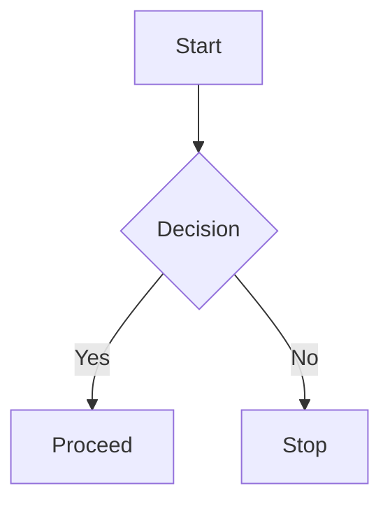

# Code Runner and Artifacts Tutorial

This tutorial shows how to create artifacts in chat messages, run executable code, and use the artifact gallery. It is written for end users and references the behavior implemented in the current frontend and backend.

## What Are Artifacts?

Artifacts are structured blocks inside a chat response that the app can detect and render specially. Supported artifact types include:
- Code (plain or executable)
- HTML
- SVG
- Mermaid diagrams
- JSON
- Markdown

The backend extracts artifacts from assistant messages and stores them with the chat message. The frontend renders them in the message view and in the Artifact Gallery.

## Create Artifacts in Chat

Artifacts are detected when the assistant responds with fenced code blocks that include a marker comment. Use these exact formats:

### Code Artifact (non-executable)
````javascript
// Example: a plain code artifact
```javascript <!-- artifact: Utility Function -->
export function clamp(value, min, max) {
  return Math.min(Math.max(value, min), max)
}
```
````

### Executable Code Artifact
````javascript
```javascript <!-- executable: Console Demo -->
console.log('Hello from the code runner')
```
````

### HTML Artifact
````html
```html <!-- artifact: Mini Layout -->
<div style="padding:16px; font-family:system-ui">
  <h2>Hello HTML</h2>
  <p>This renders inside a sandboxed iframe.</p>
</div>
```
````

### SVG Artifact
````svg
```svg <!-- artifact: Simple Icon -->
<svg width="120" height="120" viewBox="0 0 120 120" xmlns="http://www.w3.org/2000/svg">
  <circle cx="60" cy="60" r="50" fill="#4f46e5" />
</svg>
```
````

### Mermaid Artifact
````mermaid

````

### JSON Artifact
````json
```json <!-- artifact: API Response -->
{
  "status": "ok",
  "items": [1, 2, 3]
}
```
````

## Run Executable Code

Executable artifacts show a Run button in the message view and in the Artifact Gallery.

Supported languages:
- JavaScript, TypeScript
- Python (via Pyodide)

To run a snippet:
1. Create an executable code artifact using the `<!-- executable: Title -->` marker.
2. Open the artifact in the message view or the gallery.
3. Click Run.

Execution output is shown in the artifact panel and includes logs, returns, and errors.

## Load JavaScript Libraries

The JavaScript runner can load a small set of libraries from CDNs. Use this import comment at the top of your code:

```javascript
// @import lodash
console.log(_.chunk([1, 2, 3, 4], 2))
```

Available JS libraries:
- lodash
- d3
- chart.js
- moment
- axios
- rxjs
- p5
- three
- fabric

## Load Python Packages

The Python runner auto-detects common imports and loads supported packages.

```python
import numpy as np
import matplotlib.pyplot as plt

x = np.linspace(0, 2 * np.pi, 100)
y = np.sin(x)
plt.plot(x, y)
```

Available Python packages include:
- numpy, pandas, matplotlib, scipy, scikit-learn
- requests, beautifulsoup4, pillow, sympy, networkx
- seaborn, plotly, bokeh, altair

## Use the Virtual File System (VFS)

Both runners provide a simple in-memory file system. Use absolute paths to target the VFS.

### JavaScript Example
```javascript
const fs = require('fs')
fs.writeFileSync('/workspace/hello.txt', 'Hello VFS')
console.log(fs.readFileSync('/workspace/hello.txt', 'utf8'))
```

### Python Example
```python
with open('/workspace/hello.txt', 'w') as f:
    f.write('Hello VFS')

with open('/workspace/hello.txt', 'r') as f:
    print(f.read())
```

Default directories:
- `/workspace`
- `/data`
- `/tmp`

## Artifact Gallery

The Artifact Gallery aggregates all artifacts from your chat sessions in one place.

You can:
- Search, filter, and sort artifacts
- Preview and edit artifacts
- Run executable artifacts
- Export artifacts to JSON

Open the gallery from the chat UI footer (desktop).

## Tips

- Use clear artifact titles so they are easy to find later.
- Keep executable snippets short and focused.
- Prefer JSON artifacts for structured outputs you want to view or copy.
- Use HTML artifacts for small interactive demos (no external dependencies).
